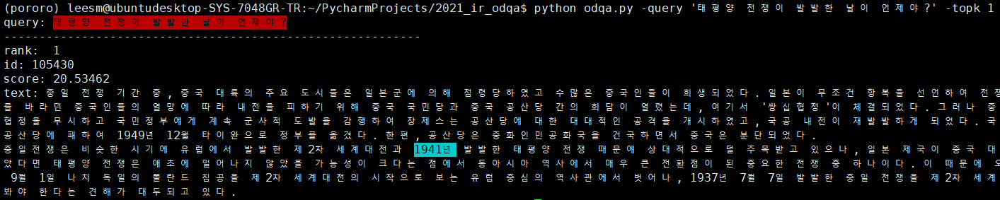

# 2021_IR_opendomainqa
2021 정보검색 과제. 한국어 위키피디아 오픈도메인 질의응답 시스템

 

## Notice
+ 검색을 위한 문서 Collection은 Korpora의 kowikitext를 사용.
+ Retriever는 BM25기반 ElasticSearch 사용.
+ Reader(MRC)는 Pororo의 MRC 모델 사용함.(KorQuAD로 학습됨)
+ linux 환경만 지원(pororo때매), Mac은 test 안해봄.
+ Docker 설치 되어있어야 됨(Elastic Search 설치 위해서) 만약 설치 안되어있다면, 따로 ElasticSearch 설치하면 됨.

## Process

1. Environment Setting
```console
pip install -r requirements.txt
docker pull docker.elastic.co/elasticsearch/elasticsearch:7.9.1
docker run -d -p 9200:9200 -p 9300:9300 -e "discovery.type=single-node" --name elasticsearch7 docker.elastic.co/elasticsearch/elasticsearch:7.9.1
```

2. Kowiki Download & Indexing
```console
python indexing.py
```

3. Get answer
```console
python odqa.py -query '바그너는 괴테의 파우스트를 읽고 무엇을 쓰고자 했는가?' -topk 3
```

4. Evaluation (Korquad Dev셋으로 OpenDomain 세팅에서 EM, F1 측정)
```console
python evaluate.py
```

## Evaluation Result
 - Dataset : KorQuAD 1.0 Dev set

|                     | EM (%) | F1 (%) |
| ----------------- | ------------ | ------------ |
| [KorQuAD](https://kakaobrain.github.io/pororo/tagging/mrc.html)            | 84.33    | 93.31    |
| KorQuAD-OPEN(ours) |         |         |


## Reference
- [ko-nlp/Korpora](https://github.com/ko-nlp/Korpora)
- [KorQuAD](https://korquad.github.io/KorQuad%201.0/)
- [kakaobrain/pororo](https://github.com/kakaobrain/pororo)
